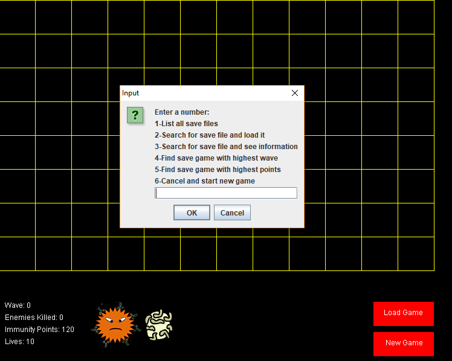

# ImmuneSystemVsBacteria  
(Note: JApplets are no longer supported - this is a JApplet, as such, pictures of the applet functioning are posted instead)  
Tower defense game where you place your towers and barriers strategically in an effort to defend the host (the human body).    
Features:
- Place towers and barriers wherever you want.
- Start wave whenever you want.
- Save/Load features.
- Two types of enemies, weak (bacteria) and strong (viruses).
- Enemies use A* pathfinding algorithm to adapt to the path you create.
- Game gets progressively harder.  

This game was a two-week project, and cannot be considered a finished project, but only a demo of some of the skills I have learned in Java over the course of two years. There are a lot of missing features, and best practices were not used in this project, as there was not nearly enough time or the requirement of using such practices. As such, the gameplay is a bit choppy and feels quite outdated compared to modern tower defense games on the internet these days. This is a note to make aware to the reader that I, the author of this program, am aware of its shortcomings and for all intents and purposes, chose to make the program this way (and true to my predictions, it turned out 100% successful).

